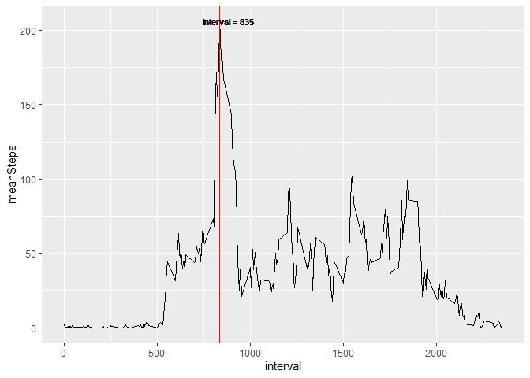
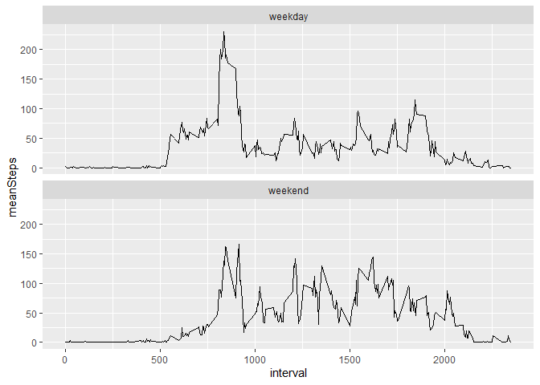

Introduction

It is now possible to collect a large amount of data about personal movement using activity monitoring devices such as a Fitbit, Nike Fuelband, or Jawbone Up. These type of devices are part of the “quantified self” movement – a group of enthusiasts who take measurements about themselves regularly to improve their health, to find patterns in their behavior, or because they are tech geeks. But these data remain under-utilized both because the raw data are hard to obtain and there is a lack of statistical methods and software for processing and interpreting the data.

This assignment makes use of data from a personal activity monitoring device. This device collects data at 5 minute intervals through out the day. The data consists of two months of data from an anonymous individual collected during the months of October and November, 2012 and include the number of steps taken in 5 minute intervals each day.

The data for this assignment can be downloaded from the course web site:

* Dataset: Activity monitoring data [52K]

The variables included in this dataset are:

* **steps**: Number of steps taking in a 5-minute interval (missing values are coded as `NA`)
* **date**: The date on which the measurement was taken in YYYY-MM-DD format
* **interval**: Identifier for the 5-minute interval in which measurement was taken


## Loading and preprocessing the data


```r
library(dplyr)
library(ggplot2)
library(knitr)
library(imputeTS)
```


Once uploaded the data, we will have to convert the date variable form **character** to **date**.


```r
unzip("activity.zip")
activity <- read.csv("activity.csv")
activity$date <- as.Date(activity$date, "%Y-%m-%d")
```


## What is mean total number of steps taken per day?

In order to solve this question, first we will have to group the data by date and then plot the sum of steps for each day.


```r
stepsDay <- activity %>% 
              group_by(date) %>% 
              summarise(stepsTotal = sum(steps, na.rm = T))

ggplot(stepsDay, aes(x=date, y= stepsTotal)) +
  geom_bar(stat = 'identity', fill="darkorchid4")+
  theme(axis.text.x = element_text(angle = 45, vjust = 1, hjust=1, size = 6))
```

<!-- -->


If now calculate for each day the mean and the median of steps and represent the result in a table:


```r
meanStepsDay <- activity %>% group_by(date) %>% summarise(average_Steps = round(mean(steps, na.rm = T), 3),
                                                          median_Steps = median(steps, na.rm = T))

kable(meanStepsDay)
```


|date       | average_Steps| median_Steps|
|:----------|-------------:|------------:|
|2012-10-01 |           NaN|           NA|
|2012-10-02 |         0.438|            0|
|2012-10-03 |        39.417|            0|
|2012-10-04 |        42.069|            0|
|2012-10-05 |        46.160|            0|
|2012-10-06 |        53.542|            0|
|2012-10-07 |        38.247|            0|
|2012-10-08 |           NaN|           NA|
|2012-10-09 |        44.483|            0|
|2012-10-10 |        34.375|            0|
|2012-10-11 |        35.778|            0|
|2012-10-12 |        60.354|            0|
|2012-10-13 |        43.146|            0|
|2012-10-14 |        52.424|            0|
|2012-10-15 |        35.205|            0|
|2012-10-16 |        52.375|            0|
|2012-10-17 |        46.708|            0|
|2012-10-18 |        34.917|            0|
|2012-10-19 |        41.073|            0|
|2012-10-20 |        36.094|            0|
|2012-10-21 |        30.628|            0|
|2012-10-22 |        46.736|            0|
|2012-10-23 |        30.965|            0|
|2012-10-24 |        29.010|            0|
|2012-10-25 |         8.653|            0|
|2012-10-26 |        23.535|            0|
|2012-10-27 |        35.135|            0|
|2012-10-28 |        39.785|            0|
|2012-10-29 |        17.424|            0|
|2012-10-30 |        34.094|            0|
|2012-10-31 |        53.521|            0|
|2012-11-01 |           NaN|           NA|
|2012-11-02 |        36.806|            0|
|2012-11-03 |        36.705|            0|
|2012-11-04 |           NaN|           NA|
|2012-11-05 |        36.247|            0|
|2012-11-06 |        28.938|            0|
|2012-11-07 |        44.733|            0|
|2012-11-08 |        11.177|            0|
|2012-11-09 |           NaN|           NA|
|2012-11-10 |           NaN|           NA|
|2012-11-11 |        43.778|            0|
|2012-11-12 |        37.378|            0|
|2012-11-13 |        25.472|            0|
|2012-11-14 |           NaN|           NA|
|2012-11-15 |         0.142|            0|
|2012-11-16 |        18.892|            0|
|2012-11-17 |        49.788|            0|
|2012-11-18 |        52.465|            0|
|2012-11-19 |        30.698|            0|
|2012-11-20 |        15.528|            0|
|2012-11-21 |        44.399|            0|
|2012-11-22 |        70.927|            0|
|2012-11-23 |        73.590|            0|
|2012-11-24 |        50.271|            0|
|2012-11-25 |        41.090|            0|
|2012-11-26 |        38.757|            0|
|2012-11-27 |        47.382|            0|
|2012-11-28 |        35.358|            0|
|2012-11-29 |        24.469|            0|
|2012-11-30 |           NaN|           NA|


## What is the average daily activity pattern?


```r
meanByInterval <- activity %>% group_by(interval) %>% summarise(meanSteps = mean(steps, na.rm = T))
MaxMinuteInterval <- meanByInterval$interval[which.max(meanByInterval$meanSteps)]

ggplot(meanByInterval, aes(x= interval, y = meanSteps)) +
  geom_line() +
  geom_vline(xintercept = MaxMinuteInterval, col = "red",)+
    geom_text(aes(x = MaxMinuteInterval+50, y=max(meanSteps), label="interval = 835"),size=3)
```

<!-- -->

On average, across all the days, the 5-minute that contains the maximum number of steps is 835.


## Imputing missing values


```r
count_NA <- sum(is.na(activity$steps))
```

The total number of missing values (**NA**) in the dataset  is 2304.

For filling the missing values, I will impute the mean of its specific time interval, creating a new dataset `activity_no_NA`:


```r
activity_no_NA <- activity %>% 
                      group_by(interval) %>% 
                      mutate(steps=ifelse(is.na(steps), mean(steps, na.rm=TRUE), steps))
```


If we plot again the steps by day although now including the imputed values to NA:


```r
statisticsByDay <- activity_no_NA %>% 
                      group_by(date) %>% 
                      summarise(totalSteps = sum(steps, na.rm = T),
                                meanSteps = round(mean(steps, na.rm = T), 3), 
                                medianSteps = round(median(steps, na.rm = T), 3))

ggplot(statisticsByDay, aes(x = date)) +
  geom_bar(aes(y = totalSteps), stat = 'identity', fill="darkorchid4") +
  theme(axis.text.x = element_text(angle = 90, vjust = 0.5, hjust=1, size = 6)) 
```

<!-- -->

The new median and mean for each day will be:


```r
kable(statisticsByDay)
```


|date       | totalSteps| meanSteps| medianSteps|
|:----------|----------:|---------:|-----------:|
|2012-10-01 |   10766.19|    37.383|      34.113|
|2012-10-02 |     126.00|     0.438|       0.000|
|2012-10-03 |   11352.00|    39.417|       0.000|
|2012-10-04 |   12116.00|    42.069|       0.000|
|2012-10-05 |   13294.00|    46.160|       0.000|
|2012-10-06 |   15420.00|    53.542|       0.000|
|2012-10-07 |   11015.00|    38.247|       0.000|
|2012-10-08 |   10766.19|    37.383|      34.113|
|2012-10-09 |   12811.00|    44.483|       0.000|
|2012-10-10 |    9900.00|    34.375|       0.000|
|2012-10-11 |   10304.00|    35.778|       0.000|
|2012-10-12 |   17382.00|    60.354|       0.000|
|2012-10-13 |   12426.00|    43.146|       0.000|
|2012-10-14 |   15098.00|    52.424|       0.000|
|2012-10-15 |   10139.00|    35.205|       0.000|
|2012-10-16 |   15084.00|    52.375|       0.000|
|2012-10-17 |   13452.00|    46.708|       0.000|
|2012-10-18 |   10056.00|    34.917|       0.000|
|2012-10-19 |   11829.00|    41.073|       0.000|
|2012-10-20 |   10395.00|    36.094|       0.000|
|2012-10-21 |    8821.00|    30.628|       0.000|
|2012-10-22 |   13460.00|    46.736|       0.000|
|2012-10-23 |    8918.00|    30.965|       0.000|
|2012-10-24 |    8355.00|    29.010|       0.000|
|2012-10-25 |    2492.00|     8.653|       0.000|
|2012-10-26 |    6778.00|    23.535|       0.000|
|2012-10-27 |   10119.00|    35.135|       0.000|
|2012-10-28 |   11458.00|    39.785|       0.000|
|2012-10-29 |    5018.00|    17.424|       0.000|
|2012-10-30 |    9819.00|    34.094|       0.000|
|2012-10-31 |   15414.00|    53.521|       0.000|
|2012-11-01 |   10766.19|    37.383|      34.113|
|2012-11-02 |   10600.00|    36.806|       0.000|
|2012-11-03 |   10571.00|    36.705|       0.000|
|2012-11-04 |   10766.19|    37.383|      34.113|
|2012-11-05 |   10439.00|    36.247|       0.000|
|2012-11-06 |    8334.00|    28.938|       0.000|
|2012-11-07 |   12883.00|    44.733|       0.000|
|2012-11-08 |    3219.00|    11.177|       0.000|
|2012-11-09 |   10766.19|    37.383|      34.113|
|2012-11-10 |   10766.19|    37.383|      34.113|
|2012-11-11 |   12608.00|    43.778|       0.000|
|2012-11-12 |   10765.00|    37.378|       0.000|
|2012-11-13 |    7336.00|    25.472|       0.000|
|2012-11-14 |   10766.19|    37.383|      34.113|
|2012-11-15 |      41.00|     0.142|       0.000|
|2012-11-16 |    5441.00|    18.892|       0.000|
|2012-11-17 |   14339.00|    49.788|       0.000|
|2012-11-18 |   15110.00|    52.465|       0.000|
|2012-11-19 |    8841.00|    30.698|       0.000|
|2012-11-20 |    4472.00|    15.528|       0.000|
|2012-11-21 |   12787.00|    44.399|       0.000|
|2012-11-22 |   20427.00|    70.927|       0.000|
|2012-11-23 |   21194.00|    73.590|       0.000|
|2012-11-24 |   14478.00|    50.271|       0.000|
|2012-11-25 |   11834.00|    41.090|       0.000|
|2012-11-26 |   11162.00|    38.757|       0.000|
|2012-11-27 |   13646.00|    47.382|       0.000|
|2012-11-28 |   10183.00|    35.358|       0.000|
|2012-11-29 |    7047.00|    24.469|       0.000|
|2012-11-30 |   10766.19|    37.383|      34.113|


When comparing both tables, we see that the mean values for those days with data are exactly the same, although the days where all the values are NA,  now have been replaced by the mean of the days (37.383) and that gives a greater value.


## Are there differences in activity patterns between weekdays and weekends?

First we create the new factor level 'day` with two levels, **weekend** and **weekday**:


```r
activity_no_NA$day <- ifelse(weekdays(activity_no_NA$date) %in% c("Saturday", "Sunday"), 
                             "weekend", "weekday")
```


```r
activity_no_NA %>% group_by(day, interval) %>% summarise(meanSteps = mean(steps, na.rm = T)) %>% 
ggplot(aes(x = interval, y = meanSteps)) +
  geom_line() +
  facet_wrap(. ~ day, nrow = 2)
```

<!-- -->

We can see that during weekdays there are a greater number of steps from interval 550 to interval 900 aprox. and around interval 2000, but the rest of the time the number of steps are greater for the weekend days.

